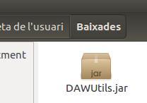
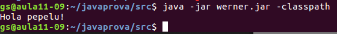
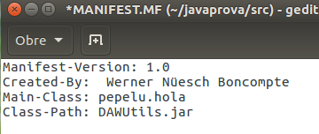

# PRACTICA WERNER EMPAQUETAR #
## 1 CREAR APLICACIONS AMB JAR ##

**1. Crea un JAR amb una aplicació que ens mostri “Hola món!”, explica clarament com i
quines instruccions has fet anar per crear-lo.**

**2. Executa el JAR, i mostra el seu resultat.**

## 2 INCLOURE JAR'S A LA MEVA APLICACIÓ ##

**1. Descarrega't el JAR DAWUtils.jar, l'API d'aquest JAR i l'exemple ProvaUtils.java.**

**2. Crea el teu propi package i actualitza el fitxer ProvaUtils.java de forma que estigui
dins d'aquest.**

**3. Intenta executar ProvaUtils. Cal fer-ho de tres formes diferents:**
**1. Fes ús de l'opció -classpath**
**2. Posa el JAR en el teu CLASSPATH**
**3. Inclou el JAR dins el teu MANIFEST.MF**

**4. Quina de les tres opcions anteriors trobes millor?**

