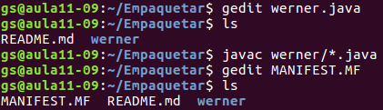
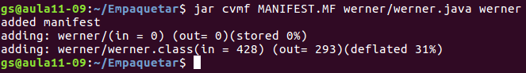
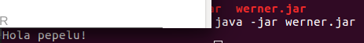

# PRACTICA WERNER EMPAQUETAR #

**1. Crea un JAR amb una aplicació que ens mostri “Hola món!”, explica clarament com i
quines instruccions has fet anar per crear-lo.**

**2. Executa el JAR, i mostra el seu resultat.**

